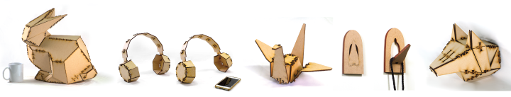
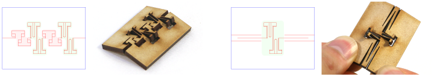
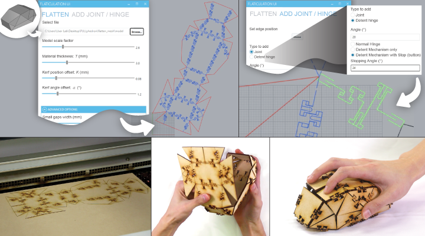
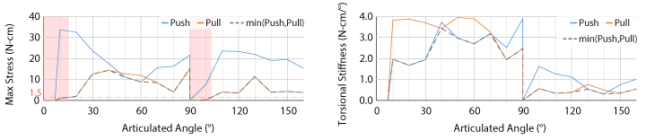
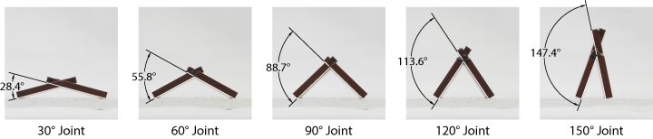

# Flaticulation: Laser Cutting Joints with Articulated Angles
[Chiao Fang](https://www.chiaofang.tw/), [ Vivian Hsinyueh Chan](http://vivianchan.tw/), [ Lung‑Pan Cheng](http://www.lungpancheng.tw/)

   

We present Flaticulation, a method to laser cut joints that clutch two cut-in-place flat boards at designated articulated angles. 
We discover special T-patterns added on the shared edge of two pieces allowing them to be clutched at a bending angle. 
We analyze the structure and propose a parametric model regarding the T-pattern under laser cutting to predict the joint articulated angle. 
We provide a user interface for our example applications, including fast assembling unfolded 3D polygonal models and adding detent mechanisms for functional objects 
such as a mouse and reconfigurable objects such as a headphone.

The Flaticulation workflow starts by using our Rhino plugin to unfold a user-loaded 3D model and adding corresponding articulated  joints on a 2D plan. 
Users can also manually apply articulated joints or detent hinges on selected edges. 
The laser cut pieces can then be assembled by folding and clutching all pieces at the right angles.
Functional objects with mechanisms can be fabricated with Flaticulation using articulated joints and detent hinges.  

  

We validate our proposed model by measuring real prototypes and conducting stress-strain analysis to understand their structural strength among joints with different articulated angles. 

### Publication
Chiao Fang, Vivian Hsinyueh Chan, and Lung‑Pan Cheng. 2022. **Flaticulation: Laser Cutting Joints with Articulated Angle**. 
In The 35th Annual ACM Symposium on User Interface Software and Technology (UIST’22)
**[ACM DL](https://doi.org/10.1145/3526113.3545695)**
